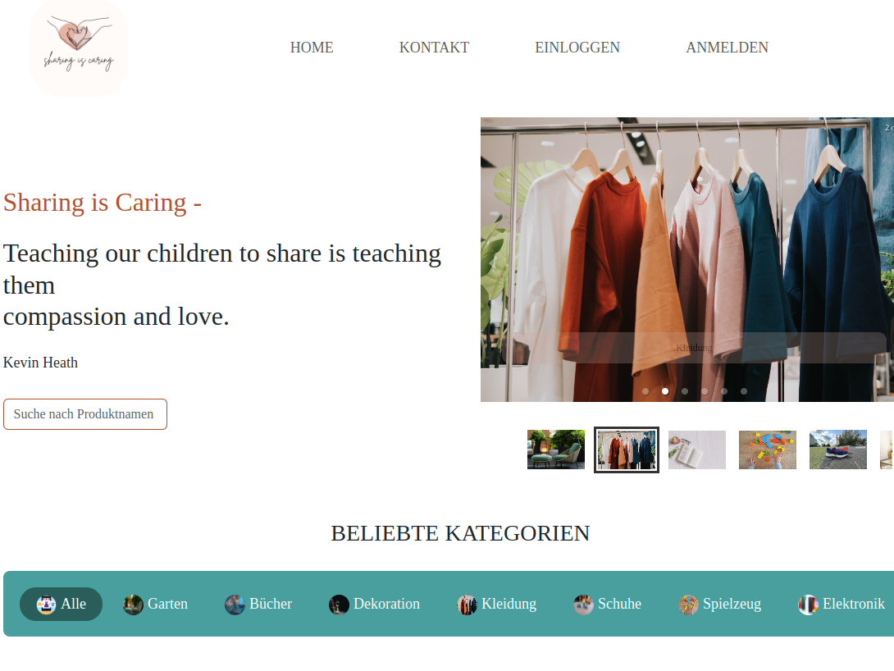
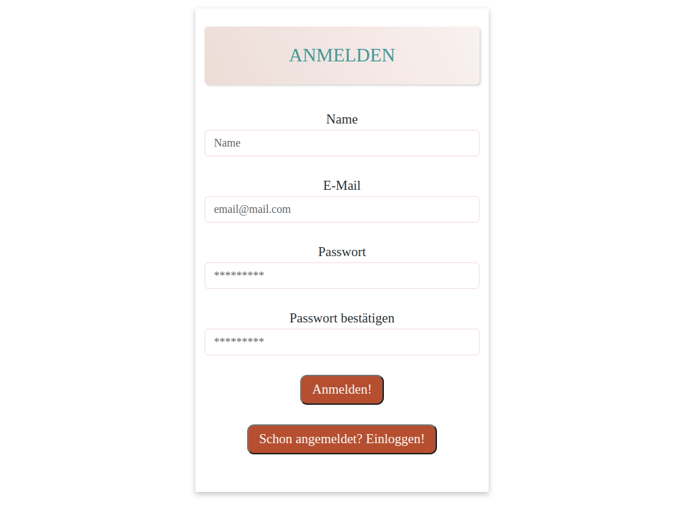
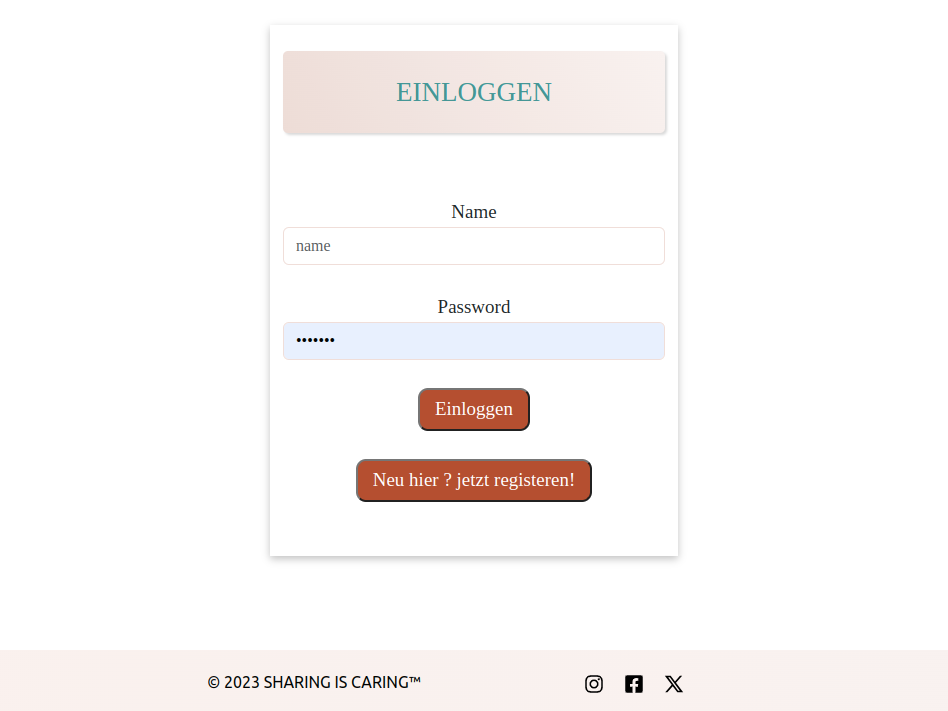
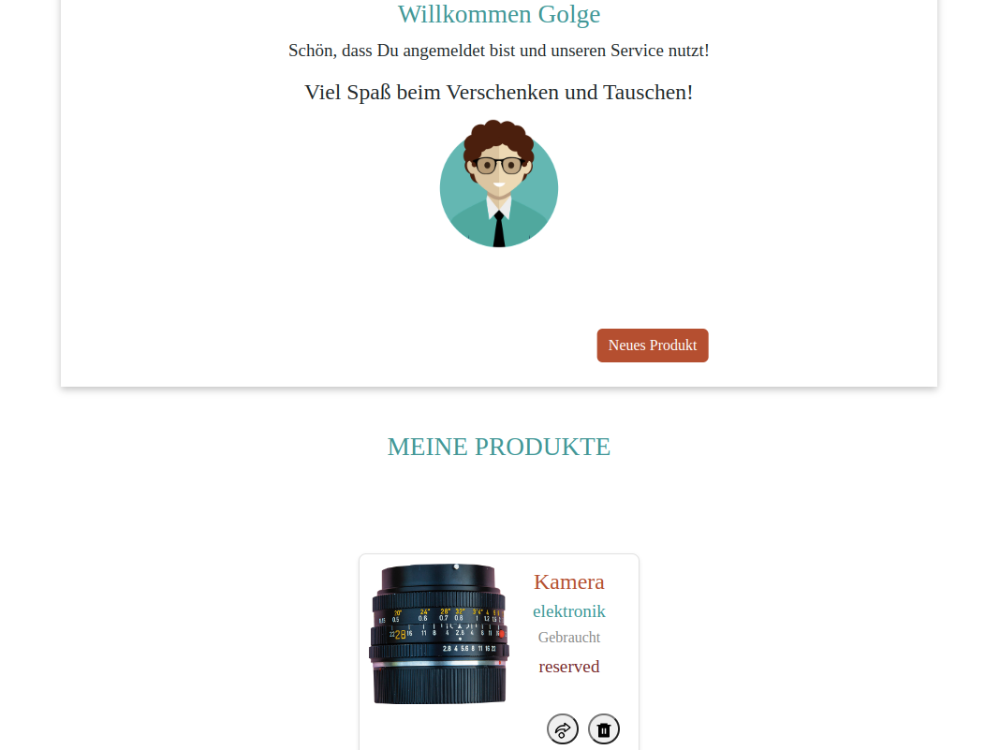
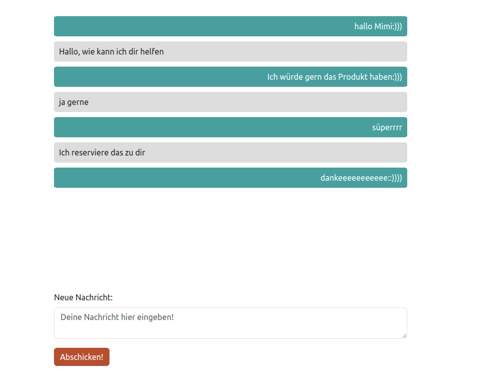
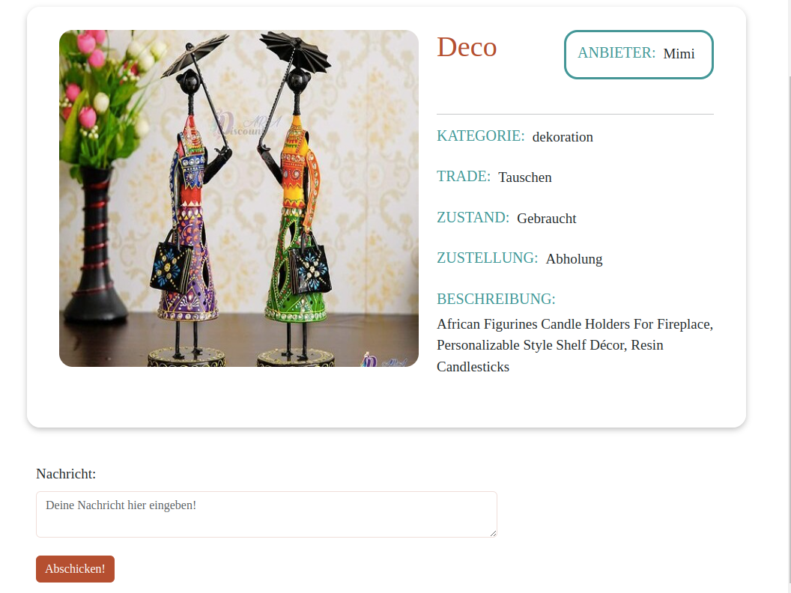

# Sharing is Caring - Final Project for our Web Development Course at DCI

## Project Details

This project serves as the final assignment for our Web Development course at DCI. As a team of five, our goal throughout the 7-week project duration was to write clean and well-documented code while enjoying the process of self-improvement. Another objective was to present a functional application that our classmates and other participants could use on the day of the final presentation. As a team, we take pride in the results we have achieved. If you want to see our project, it is  [here](https://sharing-is-caring-app.vercel.app/)

- [Back-End Repo](https://github.com/sbrycbc/sharing-is-caring-backend)

## Use of Technological Components

- React.js
- ReactScripts
- ReactStrap - Bootstrap
- ReactIcons
- App Context
- HTML -  CSS
- Base-64
- API-axios

## Responsive Design

The project has been developed with a responsive design to ensure smooth functionality on various devices.

## Carousels and Slides

The project includes custom-built components for carousels or slides (react-slick & slick-carousel & react-responsive-carousel) to create an engaging user interface.

## Images From the Project

### Home Page

### Register Page

### Login Page

### Dashboard Page 

### Messenger Page

### Card Details

## Front-End Start

`npm start`

